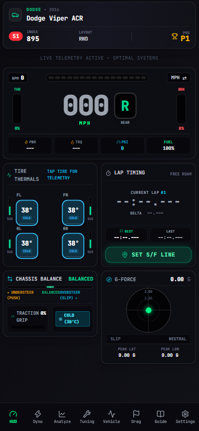
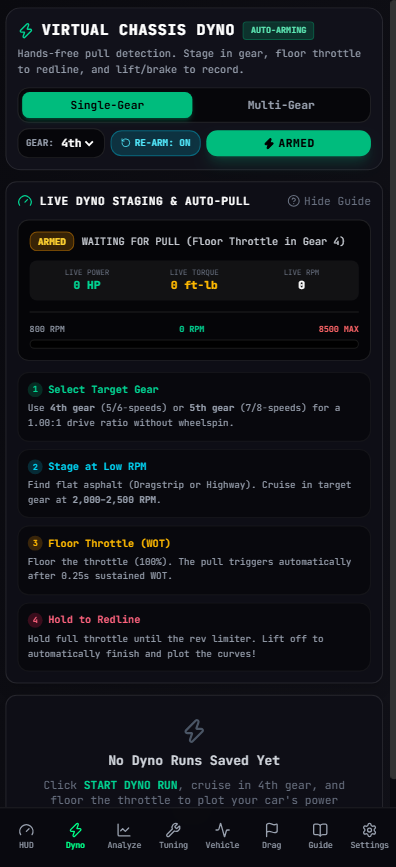
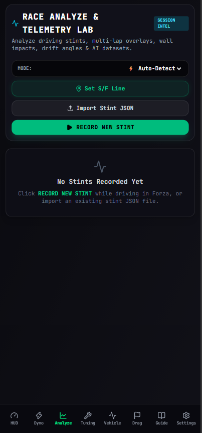
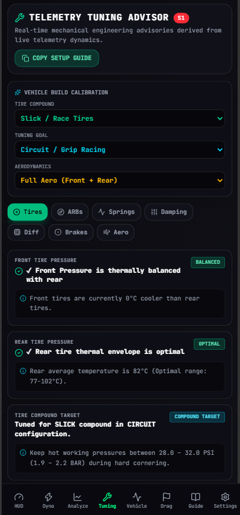
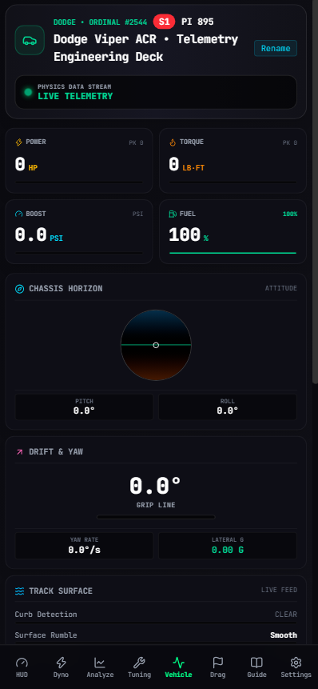
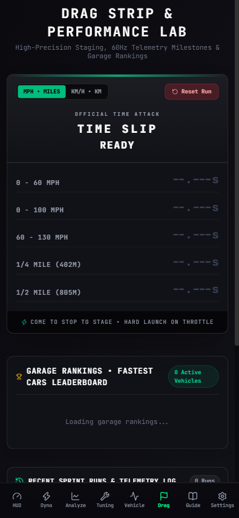

# GridPulse — High-Frequency Telemetry Suite & Mobile Cockpit PWA

> **100% Local-First LAN Architecture • Zero Cloud Dependencies • Sub-1ms Latency • 660-Car Database**

GridPulse is a real-time motorsport telemetry instrument, performance analytics engine, and chassis tuning advisor engineered for **Forza Horizon Telemetry** (UDP 324-byte Data-Out format).

It ingests high-frequency 324-byte UDP Data-Out packets streamed directly from the Forza physics engine, computes vehicle dynamics (4-corner suspension travel, tire surface thermals, slip vectors, G-forces, boost pressure, and chassis balance), and streams telemetry directly to your phone, tablet, or browser over your local home network with sub-millisecond responsiveness.

---

## Architectural Overview

GridPulse operates as a **100% Local LAN Telemetry Instrument**:

* **Local Ingress & Bridge**: The Python bridge runs directly on your gaming PC, listening on UDP port `20066` for Forza physics packets.
* **Integrated PWA Host & WebSocket Engine**: The bridge serves the complete high-performance Progressive Web App (PWA) directly from your PC at `http://<LAN-IP>:8000`, broadcasting live 60–100Hz telemetry frames over local WebSockets (`ws://<LAN-IP>:8000/ws`).
* **Zero Cloud Latency**: 100% of telemetry, stint recordings, and dyno runs remain strictly on your local network and browser IndexedDB. Zero cloud accounts or external dependencies required.

```text
┌─────────────────────────────────────────────────────────────┐
│                      LOCAL GAMING PC                        │
│                                                             │
│  [ Forza Horizon Physics Engine ]                           │
│               │ (UDP 324-Byte Data-Out on port 20066)       │
│               ▼                                             │
│  [ GridPulse-Bridge.exe (Python / FastAPI / WebSockets) ]   │
│               │ (HTTP static files + WebSocket stream)      │
│               │ Port 8000                                   │
└───────────────┼─────────────────────────────────────────────┘
                │
                │ Local Wi-Fi / LAN (< 1ms latency)
                ▼
┌─────────────────────────────────────────────────────────────┐
│               MOBILE PHONE / TABLET / BROWSER               │
│                                                             │
│  [ GridPulse PWA Dashboard (http://<LAN-IP>:8000) ]         │
│  - Live Digital Cockpit HUD (Speed, RPM, Boost, Tires, G)   │
│  - Virtual Chassis Dyno & Thrust Analyzer                   │
│  - AI Powertrain Tuning Coach & Mechanical Advisor          │
│  - Stint Recording Engine (IndexedDB Local-First)           │
└─────────────────────────────────────────────────────────────┘
```

---

## Quick Start (60 Seconds)

### Step 1: Run the GridPulse Bridge on your PC
1. Download **`GridPulse-Bridge-Windows.zip`** from [GitHub Releases](https://github.com/ghost1852/gridpulse/releases/latest) or open the web app at [https://gridpulse.wranglr.co.za](https://gridpulse.wranglr.co.za).
2. Unzip and run **`GridPulse-Bridge.exe`** (or `python backend/server.py`).
3. The bridge opens the local UDP port `20066` and prints the local QR code and LAN URL (`http://<PC-IP>:8000`).

### Step 2: Configure Forza In-Game Telemetry
In **Forza Horizon**:
1. Open **Settings** > **HUD and Gameplay** > Scroll to **Telemetry / Data Out**.
2. Set:
   * **Data Out**: `ON`
   * **Data Out IP Address**: `127.0.0.1` (or your PC's LAN IP if running Forza on Xbox)
   * **Data Out IP Port**: `20066`
   * **Data Out Packet Format**: `Car Dash` (Default 324-byte packet)

### Step 3: Connect Your Phone / Tablet
1. Scan the terminal QR code with your phone camera or navigate to `http://<PC-IP>:8000` on your home Wi-Fi network.
2. Tap **Add to Home Screen** on iOS Safari or Android Chrome to launch in fullscreen cockpit mode.
3. Telemetry streams live at 60–100Hz with sub-millisecond local latency!

---

## 📱 Visual Overview & Mobile Cockpit UI

| Digital Racing HUD | Virtual Chassis Dyno | Race Analyze & Stints |
| :---: | :---: | :---: |
|  |  |  |

| Telemetry Tuning Advisor | Vehicle Engineering Deck | Drag Strip Performance Lab |
| :---: | :---: | :---: |
|  |  |  |

---

## Core Navigation & Capabilities

### 🏎️ 1. High-Precision Racing HUD (`HudPage`)
* **Digital Speedometer**: Large digital speed display with instant MPH / KM/H toggle.
* **Flanking Pedal Meters**: Glowing Throttle (`THR`, electric green) and Brake (`BRK`, glowing red) vertical meters.
* **16-LED Shift Lights**: F1-style shift lights with redline strobe flashing at 93%+ max RPM.
* **4-Corner Tire Thermals & Lap Timer**: Embedded central lap timing between FL, FR, RL, RR tire thermals.
* **Tap-to-Inspect Telemetry**: Tap or click any tire pod on mobile or desktop to inspect corner-specific slip angle, slip ratio, suspension compression, and wheel speed.
* **Single-Screen Mobile Layout**: Compact 2x2 cockpit arrangement designed to fit on any mobile display with zero vertical scrolling.

### ⚡ 2. Virtual Chassis Dyno & Multi-Gear Thrust Lab (`DynoPage`)
* **Automated WOT Pull Assistant**: Real-time staging tachometer guiding the driver through single-gear pulls (`IDLE` ➔ `STAGING` ➔ `WIDE OPEN THROTTLE` ➔ `REDLINE` ➔ `COOLDOWN`).
* **100-RPM Binning & 3-Point Smoothing**: Produces dyno-grade horsepower and torque curves with mathematical 5,252 RPM crossover validation ($HP = \frac{TQ \times RPM}{5252}$).
* **Multi-Gear Thrust Sweeps**: Per-gear speed thrust curves (Wheel Power vs Road Speed) and optimal transmission upshift RPM recommendations.

### 📈 3. Race Telemetry & Stint Analyzer (`RaceAnalyzePage`)
* **Style-Specific Stint Detection**: Auto-detects and records `TIME_ATTACK`, `CIRCUIT`, `DRIFT`, `SPRINT`, `OFFROAD`, and `FREE_ROAM` stints directly into browser IndexedDB.
* **Honest Lap Time Capture**: Tracks lap transitions and timer rollovers with accurate zero-lap open-road handling.
* **4-Corner Suspension Travel Chart**: Continuous logging of `suspFl`, `suspFr`, `suspRl`, `suspRr` with bump-stop bottoming collision detection ($<5\%$ clearance).
* **Physics-Based Wall / Barrier Impacts**: Automatically flags external collisions ($G \ge 4.2\text{G}$ or abrupt deceleration with $<45\%$ brake pressure).
* **1-Click AI Race Coach Prompt**: Instant export formatted for Claude / ChatGPT / Gemini to diagnose driving technique and chassis balance bottlenecks.

### 🔧 4. Telemetry-Driven Tuning Advisor (`TuningBenchPage`)
* **Physical Diagnostic Framework**: `Observation → Inference → Directional Recommendation`.
* **Setup Advisories**: Concrete adjustments for Anti-Roll Bars (`▼ Soften Front ARB`), tire pressures (`▼ Lower Cold PSI`), dampers, and spring stiffness.
* **1-Click Calibration Checklist**: Ready-to-use checklist to dial in setups directly in the Forza tuning menu.

### 📊 5. Telemetry Engineering Deck (`VehicleStatsPage`)
* **Dynamic Chassis Balance**: Real-time understeer vs oversteer differential ($\Delta\alpha = \alpha_{\text{rear}} - \alpha_{\text{front}}$).
* **Traction Utilization Estimate**: Real-time friction circle acceleration demand against tire compound envelope.
* **Physics Flags**: Live indicators for `WHEELSPIN`, `LOCKUP`, `COLD TIRES` ($<135^\circ\text{F}$), `OVERHEATING` ($>235^\circ\text{F}$), and `BOTTOMING` ($<5\%$ suspension travel).

### 🏁 6. Drag Strip & Performance Testing (`DragStripPage`)
* **Automatic Launch Staging**: Detects standstill to full-throttle launch.
* **Milestone Timing**: 0-60 MPH, 0-100 MPH, 60-130 MPH, 1/4 Mile (trap speed + ET), and 1/2 Mile.

### 📖 7. Interactive Setup Guide (`LandingPage`)
* **1-Click Copy**: In-game telemetry configuration settings.
* **Local LAN Walkthrough**: Step-by-step connection guide.

### ⚙️ 8. System & Connection Settings (`SettingsPage`)
* **Units Customization**: Instant toggles for Imperial (MPH, °F, PSI) vs Metric (KM/H, °C, BAR).
* **Built-in Physics Simulator**: 60Hz telemetry generator for offline testing and UI verification.

---

## Technical Documentation

* [System Architecture & Deployment Guide](docs/architecture.md)
* [Virtual Chassis Dyno & Thrust Lab Specification](docs/dyno.md)
* [Telemetry-Driven Mechanical Tuning Advisor](docs/tuning.md)
* [Telemetry Packet Structure & Derived Dynamics](docs/telemetry.md)
* [Production Deployment Runbook](DEPLOYMENT.md)

---

## License

MIT License. Designed for sim-racers, tuners, and vehicle dynamicists.
